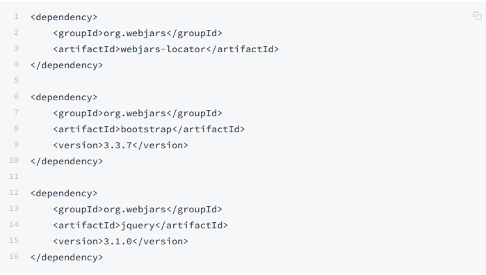
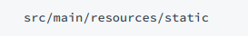
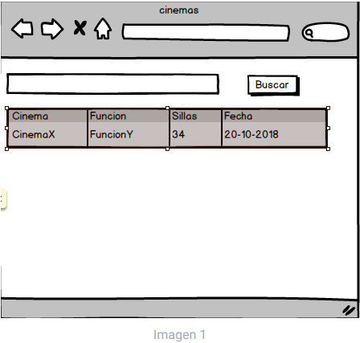
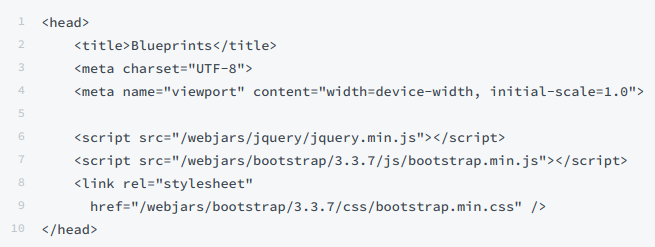
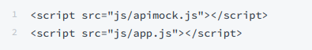

# HeavyClients

Utilizando el proyecto springboot de cinemasque sirven para el uso de librerias javascript dentro del mismo

Cree el directorio donde residirá la aplicación JavaScript. Como se está usando SpringBoot, la ruta para poner en el mismo contenido estático (páginas Web estáticas, aplicaciones HTML5/JS, etc) es:

# Construyendo la página inicial

Agregue un archivo index.html y escriba el código necesario para que luzca como la imagen 1
Agregue el siguiente código para agregar bootstrap y jquery a su proyecto

Corra la aplicación y verifique:
- Que la aplicación corra correctamente
- Que no tenga errores de 404 sobre la consola del navegador para garantizar que las librerías cargaron correctamente

# Logica Front-end
Ahora, va a crear un Módulo JavaScript que, a manera de controlador, mantenga los estados y ofrezca las operaciones requeridas por la vista. Para esto tenga en cuenta el patrón Módulo de JavaScript, y cree un módulo en la ruta static/js/app.js.

Copie el módulo provisto (apimock.js) en la misma ruta del módulo antes creado. En éste agréguele más cinemas

Agregue la importación de los dos nuevos módulos a la página HTML (después de las importaciones de las librerías de jQuery y Bootstrap):

Haga que el módulo antes creado mantenga de forma privada:
- El nombre del cinema
- El listado de funciones del cinema seleccionado

Junto con una operación pública que permita cambiar el nombre del autor actualmente seleccionado.

Agregue al módulo 'app.js' una operación pública que permita actualizar el listado de los cinemas, a partir del nombre del mismo (dado como parámetro). Para hacer esto, dicha operación debe invocar la operación 'getCinemaByName' del módulo 'apimock' provisto, enviándole como callback una función que:

	- Tome el listado de las funciones, y le aplique una función 'map' que convierta sus elementos a objetos con sólo el nombre de la función, cantidad de sillas y fecha.

	- Sobre el listado resultante, haga otro 'map', que tome cada uno de estos elementos, y a través de jQuery agregue un elemento <tr> (con los respectvos <td>) a la tabla creada en anteriormente. Tenga en cuenta los selectores de jQuery y los tutoriales disponibles en línea. Por ahora no agregue botones a las filas generadas.

	- Asocie la operación antes creada (la de app.js) al evento 'on-click' del botón de consulta de la página.

	- Verifique el funcionamiento de la aplicación. Inicie el servidor, abra la aplicación HTML5/JavaScript, y rectifique que al ingresar un cinema existente, se cargue el listado de funciones del mismo.

# Entrega próxima semana

Muestre gráficamente el estado actual de las sillas de la función de un cine escogida

Verifique que la aplicación ahora, además de mostrar el listado de las funciones de un cinema, permita seleccionar uno de éstos y mostrar el estado de la sala gráficamente. 

Una vez funcione la aplicación (sólo front-end), haga un módulo (llámelo 'apiclient') que tenga las mismas operaciones del 'apimock', pero que para las mismas use datos reales consultados del API REST. Para lo anterior revise cómo hacer peticiones GET con jQuery, y cómo se maneja el esquema de callbacks en este contexto

Modifique el código de app.js de manera que sea posible cambiar entre el 'apimock' y el 'apiclient' con sólo una línea de código.

Revise la documentación y ejemplos de los estilos de Bootstrap (ya incluidos en el ejercicio), agregue los elementos necesarios a la página para que sea más vistosa, y más cercana al mock dado al inicio del enunciado.

-----------//-----------//-----------Creado por Karen Mora-----------//-----------//-----------
